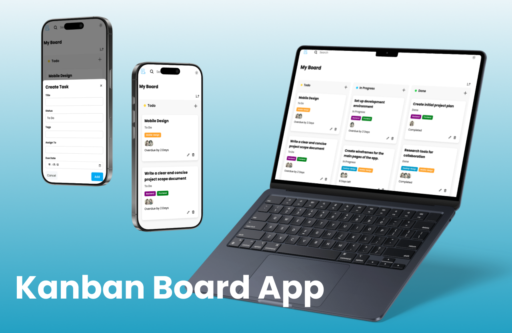

# Kanban Board App

## ✍️ Project Overview
Kanban Board App is a simple and intuitive task management tool designed to help users visualize and organize their workflow efficiently.

## 🧑‍💻 Key Features
- **Manage Your Tasks on a Board**: Organize your workflow on one board with 3 lists (To Do, In Progress, Done).
- **Drag-and-Drop Functionality**: Easily move tasks between lists with an intuitive drag-and-drop interface.
- **Task Management**: Add, edit, and delete tasks with ease.
- **Real-Time Updates**: Changes are reflected instantly, ensuring a seamless experience.
- **Sort tasks by due date**: Tasks can be sorted by due date.
- **Responsive Design**: Accessible on desktop, tablet, and mobile devices.
- **Darkmode** toggle to switch between dark and light mode in the Kanban board UI, allowing you to change the color scheme of To-Do columns and modals.

## 🛠️ Tech Stack
- **Frontend**: Astro, TypeScript
- **Database**: Supabase
- **Styling**: Sass
- **Other Tools**: Prettier
